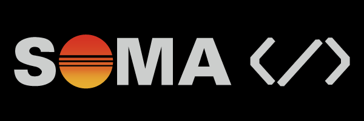

  

<h1 align="center">Soma Code</h1>

  Game Dev • Web Dev • 3D • Systems

  
  
  
  
  

---

  

  

    
  

  Currently working on an Obsidian Second Brain system, Soma3D (ultra-light portfolio with Deno/Preact/Brotli), and an ECS/ECA system for Godot.

 

  

  

    

    <table>
        <tr>
            <td>
                

                    GLADIATE is a Spectacle Fighter Card Game built Open Source from the ground up in Godot! 
                    Play with 6 unique decks and fight your way through a gauntlet of foes. 
                    Not only do you need to fight to survive, but also pull of combos to maximise your spectacle points and please the crowd.
                    Features:
                    <ul>
                        <li>Six decks with diffrent playstyles and unique combos.</li>
                        <li>Card and combo glossary</li>
                        <li>Five music tracks and a slew of sound effects</li>
                        <li>Unique card, deck and combo art.</li>
                        <li>High score tracking</li>
                    </ul>
                Now available on <a href="https://teicsoft.itch.io/gladiate" target="_blank" rel="noreferrer">itch.io</a> and <a href="https://store.steampowered.com/app/3106750/Gladiate" target="_blank" rel="noreferrer">Steam</a>!
                

            </td>
            <td></td>
        </tr>
    </table>

 

  

  <ul>
    <li>Deno + Preact sites with a focus on performance and minimal payloads.</li>
    <li>Design-forward UI with Tokyo Night palette sensibilities.</li>
    <li>Portfolio: <a href="https://soma3d.org" target="_blank" rel="noreferrer">soma3d.org</a></li>
  </ul>

 

  

  <ul>
    <li>ECS/ECA architecture, tools, and automation.</li>
    <li>TypeScript and clean API design for maintainable systems.</li>
    <li>Cross-discipline pipelines that keep projects fast and tidy.</li>
  </ul>

 

  

  

    
    
    
    
    
    
    
    
    
    
    
  

